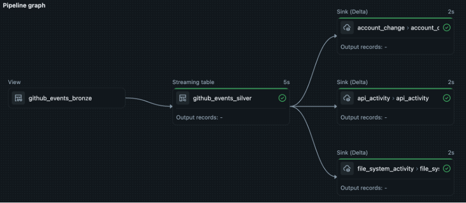

# Zerobus + SDP Cyber Lakehouse Pipeline

End-to-end pipeline that ingests [GitHub public events](https://docs.github.com/en/rest/using-the-rest-api/github-event-types) via **Databricks Zerobus**, processes them through a **Spark Declarative Pipelines (SDP)** [medallion architecture](https://docs.databricks.com/en/lakehouse/medallion.html), and normalizes to **[OCSF v1.7.0](https://schema.ocsf.io/1.7.0/)** gold tables (API Activity, Entity Management, File System Activity).

## Architecture

```
GitHub Events API → Zerobus → SDP Pipeline [ bronze → silver → api_activity (6003) / entity_management (3004) / file_system_activity (1001) ]
```

### Pipeline Graph



## OCSF Event Classes

| Gold Table | OCSF Class | class_uid | GitHub Events |
|---|---|---|---|
| `api_activity` | API Activity | 6003 | All events |
| `entity_management` | Entity Management | 3004 | CreateEvent, DeleteEvent, ForkEvent, ReleaseEvent, PublicEvent |
| `file_system_activity` | File System Activity | 1001 | PushEvent |

## Prerequisites

- Databricks workspace with Zerobus access enabled
- [Service principal](https://docs.databricks.com/en/admin/users-groups/service-principals.html) with OAuth credentials (client_id / client_secret)
- [Databricks CLI](https://docs.databricks.com/en/dev-tools/cli/install.html) installed (`pip install databricks-cli`)
- Python 3.9+

## File Overview

```
├── pipeline/                    ← SDP source (point pipeline here)
│   ├── utils_pipeline.py
│   ├── ingest_bronze.py
│   ├── flatten_silver.py
│   └── normalize_gold.py
├── setup/                       ← run manually before the pipeline
│   ├── utils_setup.py
│   ├── ddl_bronze.py
│   ├── ddl_ocsf.py
│   └── push_zerobus.py
├── requirements.txt
└── README.md
```

| File | Location | Purpose |
|---|---|---|
| `utils_pipeline.py` | `pipeline/` | SDP config — `UC`, `TABLES`, `FQN`, `TABLE_PROPERTIES`, `OCSF` dicts |
| `ingest_bronze.py` | `pipeline/` | SDP temporary view — passthrough over the Zerobus-populated bronze table |
| `flatten_silver.py` | `pipeline/` | SDP streaming table — extracts typed columns from variant data |
| `normalize_gold.py` | `pipeline/` | SDP append flows — maps silver to 3 OCSF Delta sinks |
| `utils_setup.py` | `setup/` | Setup config — `UC`, `TABLES`, `FQN`, `GITHUB`, `ZEROBUS` dicts |
| `ddl_bronze.py` | `setup/` | Creates catalog, databases, and the bronze table |
| `ddl_ocsf.py` | `setup/` | Creates the 3 OCSF gold Delta tables |
| `push_zerobus.py` | `setup/` | Polls GitHub Events API and pushes to bronze via Zerobus |

## Configuration

Both config files use dictionaries to organize variables:

**`pipeline/utils_pipeline.py`** — used by SDP pipeline scripts:

```python
UC = { "catalog": "cyber_lakehouse", "bronze_database": "github", ... }
TABLES = { "bronze": "github_events_bronze", "silver": "github_events_silver", ... }
FQN = { "bronze": "cyber_lakehouse.github.github_events_bronze", ... }
TABLE_PROPERTIES = { "delta.minWriterVersion": "7", "delta.enableDeletionVectors": "true", ... }
OCSF = { "version": "1.7.0", "category": { ... }, "class": { ... } }
```

**`setup/utils_setup.py`** — used by DDL and Zerobus scripts:

```python
UC = { "catalog": "cyber_lakehouse", "bronze_database": "github", "gold_database": "ocsf" }
TABLES = { "bronze": "github_events_bronze", "api_activity": "api_activity", "entity_management": ..., "file_system_activity": ... }
FQN = { "bronze": "cyber_lakehouse.github.github_events_bronze", ... }
GITHUB = { "events_url": "https://api.github.com/events", "source": "github", ... }
ZEROBUS = { "workspace_url": "<your-workspace-url>", "workspace_id": "<your-workspace-id>", ... }
```

## Execution Steps

1. [Create a service principal](#1-create-a-service-principal)
2. [Store credentials in a Databricks secret scope](#2-store-credentials-in-a-databricks-secret-scope)
3. [Configure workspace settings](#3-configure-workspace-settings)
4. [Create catalog, databases, and bronze table](#4-create-catalog-databases-and-bronze-table)
5. [Grant service principal permissions](#5-grant-service-principal-permissions)
6. [Create OCSF gold Delta tables](#6-create-ocsf-gold-delta-tables)
7. [Start the Zerobus producer](#7-start-the-zerobus-producer)
8. [Deploy the SDP pipeline](#8-deploy-the-sdp-pipeline)
9. [Verify](#9-verify)
10. [Schedule the pipeline](#10-schedule-the-pipeline)

---

### 1. Create a service principal

1. In your Databricks workspace, go to **Settings** → **Identity and access** → **Service principals**
2. Click **Add service principal** → **Add new**
3. Name it (e.g. `zerobus-ingest`) and click **Add**
4. Click the new service principal → **Secrets** tab → **Generate secret**
5. Copy the **Client ID** and **Secret** immediately (the secret is only shown once)

### 2. Store credentials in a Databricks secret scope

Create a secret scope and store the credentials using the Databricks CLI:

```bash
# authenticate the CLI
databricks auth login <workspace-url> --profile=<profile-name>

# create the scope
databricks secrets create-scope zerobus --profile=<profile-name>

# store the credentials (use the exact values from Step 1)
databricks secrets put-secret zerobus client-id --string-value "<client-id>" --profile=<profile-name>
databricks secrets put-secret zerobus client-secret --string-value "<client-secret>" --profile=<profile-name>
```

Alternatively, from a Databricks notebook using `%sh`:

```bash
%sh
databricks secrets create-scope zerobus
databricks secrets put-secret zerobus client-id --string-value "<client-id>"
databricks secrets put-secret zerobus client-secret --string-value "<client-secret>"
```

Alternatively, use the **Databricks Python SDK** from a notebook cell:

```python
from databricks.sdk import WorkspaceClient

w = WorkspaceClient()

w.secrets.create_scope(scope="zerobus")
w.secrets.put_secret(scope="zerobus", key="client-id", string_value="<client-id>")
w.secrets.put_secret(scope="zerobus", key="client-secret", string_value="<client-secret>")
```

The pipeline reads credentials at runtime via `dbutils.secrets.get()`.

### 3. Configure workspace settings

Edit `setup/utils_setup.py` and fill in the `ZEROBUS` dictionary:

```python
ZEROBUS = {
    "workspace_url": "https://<your-workspace>.cloud.databricks.com",
    "workspace_id":  "<your-workspace-id>",   # from workspace URL /o=<id>
    "region":        "us-east-1",             # adjust to your region
    "secrets_scope": "zerobus",
}
```

### 4. Create catalog, databases, and bronze table

Run `setup/ddl_bronze.py` as a Databricks notebook or execute the SQL manually.

> **Important:** Zerobus does not support tables in default metastore storage.
> The catalog or schema must have an explicit **[managed storage location](https://docs.databricks.com/en/sql/language-manual/sql-ref-syntax-ddl-create-schema.html)**.
> If your catalog uses default storage, set a managed location on the schema:
>
> ```sql
> CREATE DATABASE IF NOT EXISTS <catalog>.<database>
> MANAGED LOCATION 's3://<bucket>/<path>';
> ```

```sql
CREATE CATALOG IF NOT EXISTS cyber_lakehouse;
CREATE DATABASE IF NOT EXISTS cyber_lakehouse.github;
CREATE DATABASE IF NOT EXISTS cyber_lakehouse.ocsf;

CREATE TABLE IF NOT EXISTS cyber_lakehouse.github.github_events_bronze (
    data            VARIANT,
    event_time      TIMESTAMP,
    event_date      DATE,
    source          STRING,
    source_type     STRING,
    source_path     STRING,
    processed_time  TIMESTAMP
)
USING DELTA
TBLPROPERTIES ('delta.feature.variantType-preview' = 'supported');
```

> The `data` column uses the [VARIANT](https://docs.databricks.com/en/sql/language-manual/data-types/variant-type.html) type, which stores semi-structured JSON natively in Delta.

### 5. Grant service principal permissions

Run in a Databricks SQL editor (replace `<service-principal-application-id>` with the SP's **Application ID UUID**):

```sql
-- catalog access
GRANT USE CATALOG ON CATALOG cyber_lakehouse TO `<service-principal-application-id>`;

-- database access
GRANT USE DATABASE ON DATABASE cyber_lakehouse.github TO `<service-principal-application-id>`;

-- read/write table access
GRANT SELECT, MODIFY ON TABLE cyber_lakehouse.github.github_events_bronze TO `<service-principal-application-id>`;
```

> **Note:** Use the service principal's **Application ID (UUID)**, not the display name. Find it under **Settings** → **Identity and access** → **Service principals** → click your SP.

### 6. Create OCSF gold Delta tables

Run `setup/ddl_ocsf.py` as a Databricks notebook or execute the SQL manually. This creates the three Delta sink tables in `cyber_lakehouse.ocsf`.

### 7. Start the Zerobus producer

**From a Databricks notebook:**

```python
%pip install databricks-zerobus-ingest-sdk requests
```

Then run `setup/push_zerobus.py` directly (Databricks treats `.py` files as notebooks) or use `%run ./push_zerobus` followed by `main()`.

**From local terminal:**

```bash
pip install databricks-zerobus-ingest-sdk requests
cd setup
python push_zerobus.py
```

The script auto-installs dependencies on each run. It polls the GitHub Events API every 60 seconds and pushes structured bronze records via Zerobus. By default it stops after 5 minutes (`RUN_DURATION_SEC = 300`). Set to `None` to run indefinitely.

### 8. Deploy the SDP pipeline

Upload the `pipeline/` folder to your Databricks workspace. Then create a new **Lakeflow Declarative Pipeline**:

1. Go to **Jobs & Pipelines** → **Create** → **ETL Pipeline**
2. Set the source to the uploaded `pipeline/` folder
3. Click **Start**

The SDP pipeline will:
- Wrap the bronze table as a temporary view (`ingest_bronze.py`) so it appears in the pipeline graph
- Stream from bronze → silver, flattening variant fields (`flatten_silver.py`)
- Stream from silver → 3 OCSF gold Delta sinks (`normalize_gold.py`)

### 9. Verify

Query the gold tables:

```sql
SELECT * FROM cyber_lakehouse.ocsf.api_activity LIMIT 10;
SELECT * FROM cyber_lakehouse.ocsf.entity_management LIMIT 10;
SELECT * FROM cyber_lakehouse.ocsf.file_system_activity LIMIT 10;
```

### 10. Schedule the pipeline

To run the pipeline on a recurring schedule:

1. Go to **Jobs & Pipelines** and select your pipeline
2. Click **Schedule** → **Add schedule**
3. Set a cron expression or interval (e.g. every 15 minutes, hourly)
4. Click **Save**

Alternatively, add the pipeline as a task in a **Databricks Job** for more control over triggers, retries, and notifications. See [Pipeline task for jobs](https://docs.databricks.com/aws/en/jobs/pipeline) for details.

### Resetting streaming checkpoints

Gold table OCSF logic or DDL changes may require reprocessing data. [Resetting streaming flow checkpoints](https://docs.databricks.com/aws/en/ldp/updates#start-a-pipeline-update-to-clear-selective-streaming-flows-checkpoints) via the REST API avoids a full refresh on the bronze and silver streaming tables. Use the fully qualified flow path as `catalog.schema.table` (e.g. `cyber_lakehouse.ocsf.api_activity`):

```bash
curl -X POST \
  -H "Authorization: Bearer <your-token>" \
  -H "Content-Type: application/json" \
  -d '{
    "reset_checkpoint_selection": ["<catalog.schema.table>"]
  }' \
  https://<your-workspace>.cloud.databricks.com/api/2.0/pipelines/<your-pipeline-id>/updates
```

## Documentation

- **Databricks Zerobus**
  - [Zerobus Python SDK (GitHub)](https://github.com/databricks/zerobus-sdk-py)
  - [Zerobus Ingest Documentation](https://docs.databricks.com/en/ingestion/zerobus/index.html)

- **Spark Declarative Pipelines (SDP)**
  - [SDP Programming Guide](https://spark.apache.org/docs/latest/declarative-pipelines-programming-guide.html)
  - [Lakeflow Declarative Pipelines](https://docs.databricks.com/en/lakeflow-declarative-pipelines/index.html)

- **OCSF (Open Cybersecurity Schema Framework)**
  - [OCSF Schema Browser (v1.7.0)](https://schema.ocsf.io/1.7.0/)
  - [IAM Category](https://schema.ocsf.io/1.7.0/categories/iam) — Entity Management (3004)
  - [System Activity Category](https://schema.ocsf.io/1.7.0/categories/system) — File System Activity (1001)
  - [Application Activity Category](https://schema.ocsf.io/1.7.0/categories/application) — API Activity (6003)
  - [OCSF GitHub](https://github.com/ocsf)
